# Simple Stepper Motor Analyzer

&nbsp;

https://github.com/zapta/simple_stepper_motor_analyzer

&nbsp;

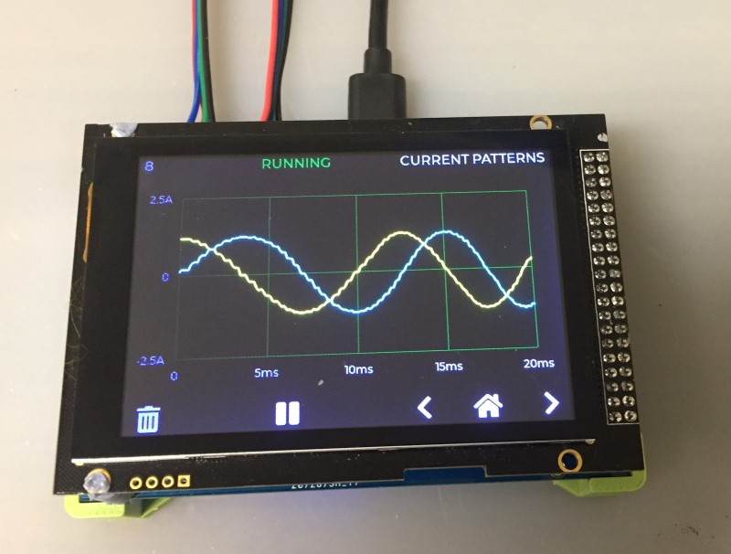

&nbsp;

## Highlights
* Low cost and minimalist DYI hardware design.
* Standalone. Doesn't require a computer to operate.
* Analyzes the stepper motor signals in the actual system (e.g. a 3D printer).
* Does not interfere with the operating equipment. Galvanically isolated current sensors.
* Each to connect.
* Intuitive color/touch user interfere.
* Resolution of 0.01 of a full step.
* Provides momentary readings, signal patterns, and statistical measurements.
* Hardware and software are open sourced with a generous license.
* Based on free tools (Kicad, platformio, LVGL, STM32Duino).
* Can be easily customized (new featured, cost reduction, data link to a computer, etc).
* Requires 5VDC, 200ma and a micro USB  cable.

## Overview
Diagnosing the operation of stepper motor in 3D printers and CNC machines used to require stepper motor analyzers that costs thousands of dollar. Not anymore! The Simple Stepper Analyzer ('Analyzer' in short) brings these capabilities to every maker for a tiny fraction of the price and with a minimalist DIY electronic design that leaves the heavy lifting to the firmware.

The Analyzer is self contained, has two 4-wires pass-through connectors connecting the stepper motor, is powered from a common 5V charger with a micro USB cable, provides a simple to use graphical user interface with a 3.5" color touch screen, and provides a plethora of stepper motor measurements.

The Analyzer is provided to the community as a public domain reference design that can be built and used as is, or be customized with additional features or for a lower cost as desired. The hardware and firmware come with a liberal open source license (CC0) that allows commercial usages and doesn't require code source code sharing.

---
## Disclaimer
THE DESIGN IS PROVIDED "AS IS", WITHOUT WARRANTY OF ANY KIND, EXPRESS OR IMPLIED, INCLUDING BUT NOT LIMITED TO THE WARRANTIES OF MERCHANTABILITY, FITNESS FOR A PARTICULAR PURPOSE AND NONINFRINGEMENT. IN NO EVENT SHALL THE AUTHORS OR COPYRIGHT HOLDERS BE LIABLE FOR ANY CLAIM, DAMAGES OR OTHER LIABILITY, WHETHER IN AN ACTION OF CONTRACT, TORT OR OTHERWISE, ARISING FROM, OUT OF OR IN CONNECTION WITH THE DESIGN OR THE USE OR OTHER DEALINGS IN THE DESIGN.

---
## How does it work?
The principle of operation is very simple, and so is the hardware design. The stepper motor is connected via 4 wire pass-though connectors that allow the Analyzer to monitor the current through the stepper's coils. The Analyzer's user low impedance current sensors that are galvanically isolated such does not interfere with the operation of the 3D printer or other equipment it monitors. The Analyzer measures the coils currents 100k times a second and uses firmware that analyzes the data, extracts the desired measurements, and present them on the screen. For example, this is how an analysis of the distribution of distance by speed distribution looks like:

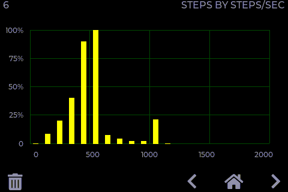

---
## Operation is simple and intuitive

1. Turn off power to the equipment (e.g. 3D printer).
2. Disconnect the 4 wires of the stepper motor and connect them through the Analyzer two pass through connectors.
3. Power the analyzer using a 5V charger and a micro USB cable.
4. Turn on the equipment and get the stepper going.
5. Use the Analyzer's screen to view the measurements you want.

**NOTE:** The two pass-through connectors of the Analyzer are symmetric and  each can act as an input or output. 

**CAUTION:** Always connect and disconnect stepper motors when their controller is not energized, to reduce the risk of damage to the controller due to high voltage spikes. The analyser itself is not subject to that risk since its uses galvanically isolated current sensors.

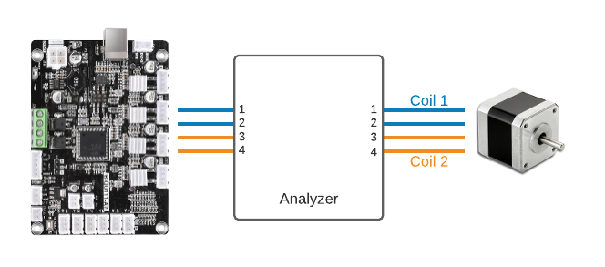

**NOTE:** The only requirement for proper wiring is that the two wires of one coil should go through pins pair 1,2 and the two wires of the other coil should go through pin pair 3,4. The Analyzer doesn't care about the +/- polarity of the wires in each pair, nor does it care which of the two pass-through connectors is on the controller side and which one is on the stepper side.

**TRIVIA:**: The pin out and the connector type of the Analyzer follows the Duet3D conventions, except that is uses right angle connector to save space.

---
## The Home Page
The Home page is first page shown when the Analyzer is powered on. It provides summary information as well as access to the Settings page.

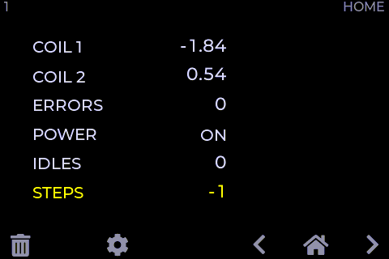

&nbsp;

#### Page Data

Field | Description
:------------ | :-------------
 COIL&nbsp;1 | Momentary coil 1 current in Amps.
 COIL&nbsp;2 | Momentary coil 2 current in Amps.
 ERRORS | The number of phase errors detected so far. Phase errors happens when the current patterns are so distorted that a forward/backward movement cannot be determined.
 POWER | Indicates if the stepper motor is currently energized. This is determined by the sum of currents in they two coils.
 IDLES | The number of times that stepper motor change status from energized to non energized.
 STEPS | The distance the stepper moved so far. Each full step forward increments this value by one and each full step backward decrements it by one. When the stepper motor is energized, the display also shows fractional steps in resolution of 1/100th of a full step.

HINT: The fractional step value cannot be reset because it is derived from the momentary currents in the two coils. Only the stepper motor driver can reset the fraction by positioning the stepper motor on an exact full step.

HINT: To swap forward/backward directions of the Analyzer use the Settings page. This does not affect the stepper motor itself.

&nbsp;
#### Page Actions

Action | Description
:------------: | :-------------
 | Clear all data.
 | Open the Settings page.

&nbsp;

---

## The Settings Page

This is a special page that is accessible from the Home page and allows to calibrate the Analyzer. The settings are stored in a non volatile memory and are preserved when the Analyzer is turned off.

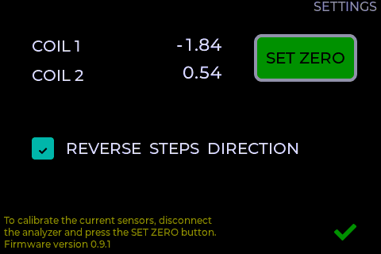

&nbsp;
#### Page Data

Data | Description
:------------: | :-------------
COIL&nbsp;1 | The momentary current of stepper coil 1 in Amp units. Should be zero, or very close to zero, when the stepper motor is disconnected.
COIL&nbsp;2 | The momentary current of stepper coil 2 in Amp units. Should be zero, or very close to zero, when the stepper motor is disconnected.

&nbsp;
#### Page Actions

Action | Description
:------------: | :-------------
SET ZERO | Used to calibrate the zero reading of the current sensors. To do so, Disconnect the stepper motor and press this button.
REVERSE STEPS DIRECTION | Changes the forward/backward step directions of the Analyzer. Does not affect the stepper motor itself. Having the correct direction is important for measurements such as the Retraction analysis.
 | Press exist the Settings page.

&nbsp;

---

## The Speed Dial Page

This page measure the stepper speed in units of full steps per second. 

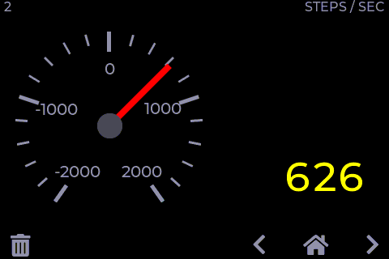

&nbsp;
#### Page Data

Data | Description
:------------ | :-------------
Speed&nbsp;Dial | The speed dial shows the momentary stepper speed in full steps per second units. Forward speed is on the right side and backward speed is on the left.
Speed&nbsp;Value | This field shows the speed in a numeric form. IT is updated less frequently than the dial to allow easy reading.

&nbsp;
**HINT:** The Settings page allows to swap the forward/backward directions.

&nbsp;
#### Page Actions

Action | Description
:------------: | :-------------
 | Clears all data.
Tap the dial |Toggles the dial's speed range.

&nbsp;

---

## The Distance Graph Page

This page shows scrolling graph with the total number of full steps vs. time.

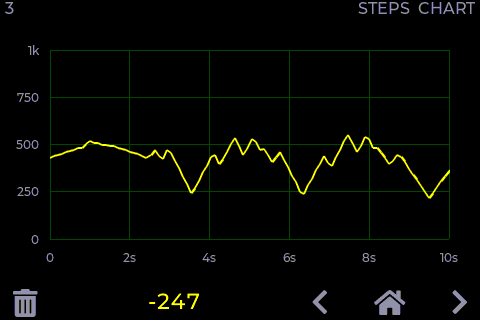

&nbsp;

#### Page Data

Data | Description
:------------ | :-------------
Distance&nbsp;Graph | This graph shows how the distance, in units of full steps, changes over time.
Distance&nbsp;value | The numeric value of the distance in full steps.  This fields is identical to the STEPS field in the Home page.

&nbsp;

#### Page Actions

Action | Description
:------------: | :-------------
 | Clears all data.
Tap the graph | Toggles the range of the vertical axis.

&nbsp;

---

#### The Retraction Graph Page

This page is useful to analyze the retraction in of 3D printer extruder.

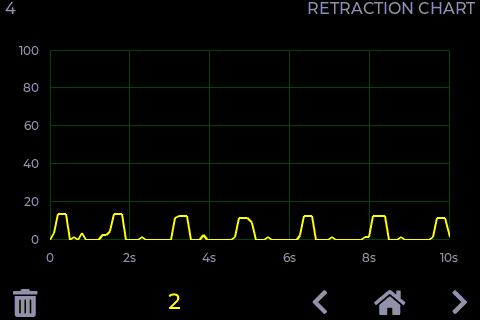

&nbsp;
**TRIVIA:** The graph above was taken while testing a direct extruder printer with [Thing #909901](https://www.thingiverse.com/thing:909901).
&nbsp;
#### Page Data

Data | Description
:------------ | :-------------
Retraction&nbsp;Graph | This graphs tracks the retraction of 3D extruder full step units.  Retraction is defined as the filament length that was inside the extruder and is now retracted outside of the extruder. 
Retraction value |  This field shows the current retraction level in a numeric form.

&nbsp;
#### Page Actions

Action | Description
:------------: | :-------------
 | Clear all data.
Tap the graph | Changes the range of the vertical axis.

&nbsp;

---

## The Time by Speed Page

This page shows an histogram with the distributing of time by stepper speed. That is how much time was spent in each speed range. The values are normalized such that the longest bar is always at 100%.

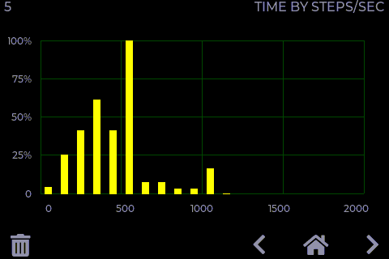

&nbsp;
#### Page Data

Data | Description
:------------ | :-------------
Time&nbsp;Histogram | The horizontal axis indicates speed in full steps per second units. The height of each bar indicate the time of all steps in that speed range, with the length of the longest bar normalized to 100%.

&nbsp;
#### Page Actions

Action | Description
:------------: | :-------------
 | Clear all data.

&nbsp;

---

## The Distance by Speed Page

This page shows an histogram with the the distribution of distance by stepper speed.

&nbsp;
#### Page Data

Data | Description
:------------ | :-------------
Distance&nbsp;Histogram |  The horizontal axis indicates speed in full steps per second units. The height of each bar indicate the distance or number of steps in that speed range, with the length of the longest bar normalized to 100%.

&nbsp;
#### Page Actions

Action | Description
:------------: | :-------------
 | Clear all data.

&nbsp;

---

## The Current by Speed Page

This page measures the ability of the stepper motor's controller to maintain peak current at high speeds.

The screenshot below shows a healthy system where the peak current is virtually flat across the speed range.

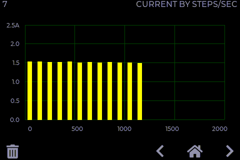

The screenshot below shows a system that is not capable to maintain peak current and starves the stepper motor at high speeds, resulting in poor torque and possible skipped steps.

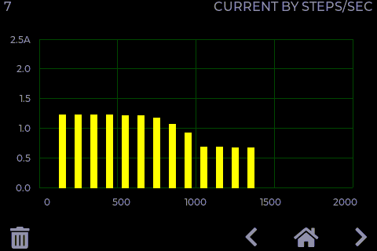

&nbsp;
#### Page Data

Data | Description
:------------ | :-------------
Peak&nbsp;Current&nbsp;Histogram | The horizontal axis indicates speed in full steps per second units. The height of each bar indicates the average peak current in Amps of  steps that speed range. 

&nbsp;
#### Page Actions

Action | Description
:------------: | :-------------
 | Clear all data.

&nbsp;

---

## Coil Current Patterns Page

This page shows the current patterns in the two stepper coils.

The screenshot below shows a healthy system where the signals are nice and clean and reaches the target peak current.

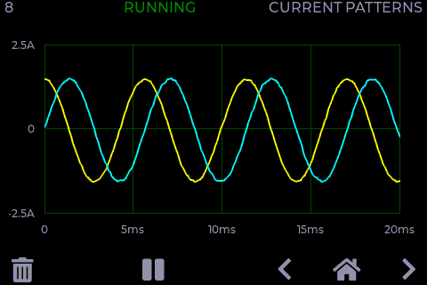

&nbsp;

The screenshot below is from a poor system where high speed results in distorted and insufficient current, resulting in loss of torque and a potential for skipped steps.

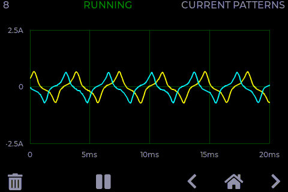

&nbsp;

**GENERAL INFORMATION:** Each cycle of the stepper current pattern represent 4 full steps. The centers of those steps are at on the four vertical dotted lines where the currents of the two coils are identical, in the same or in  opposite polarities. The transitions between the steps are on the 4 vertical solid lines where one of the coils is at zero current. This cycle of 4 full steps is sometimes referred to as a single 'electric rotation'. The analyzer computes the exact phase on this cycle using the standard trigonometric function atan2(current1, current2) which can also be calculated manually from the current readings in the Home page.

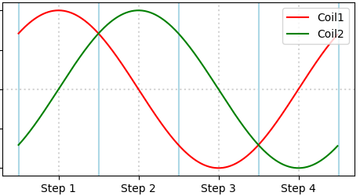

&nbsp;

#### Page Data

Data | Description
:------------ | :-------------
Current&nbsp;graph | The horizontal axis indicates time in milliseconds. The vertical axis indicate coil current level in Amps. The two graphs show the current patterns of the respective stepper coils.

**NOTE:** The graph is updated only when sufficient stepper motor movement is detected.

&nbsp;
#### Page Actions

Action | Description
:------------: | :-------------
 | Clear all data.
 | When running, pauses the display updates.
 | When paused, resume the display updates.
Tap the graph | This toggles the range of the horizontal axis.

&nbsp;

---

## Coil Current Phase Page

This page draws the current patterns of the two coils as a [Lissajous curve](https://en.wikipedia.org/wiki/Lissajous_curve) which allows to examine visually distortions such as non sinusoidal current, phase distortion, and reduced amplitude.

In an ideal system, the graph is a perfect smooth circle, that doesn't change its size when the stepper's speed changes. Patterns that significantly diverge from that indicates a sub optimal configuration and operation.

Following picture shows a pattern from a well functioning system. The graph is round, reasonable smooth, and has sufficient size which indicates good current drive. 

The horizontal axis indicates the coil 1 current and the vertical axis indicates coil 2 current. In this example, both span nicely between -2A to +2A.

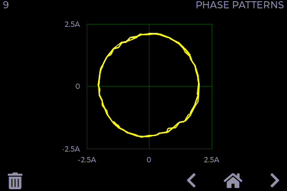

&nbsp;

The screenshot below is from a poor system where high speed results in distorted and insufficient current, resulting in loss of torque and a potential for skipped steps. The pattern is far from a clean circle and the shape has reduced size.

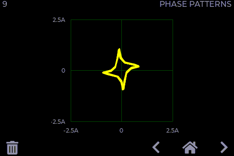

&nbsp;

The screenshot below shows a sub optimal operation where a a speed increase of the stepper results in small (less current and torque) and even more distorted curve.

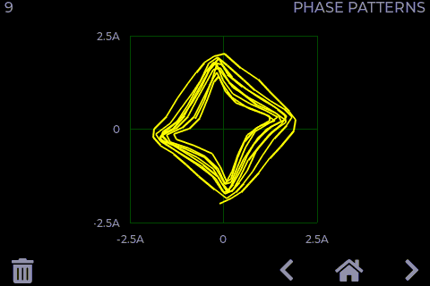

&nbsp;

The screenshot below shows a well functioning system. The smaller size of the circle compare to the example above indicates that it operates on lower current.

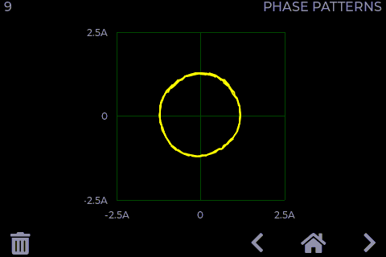

&nbsp;

The screenshot below show an operation of a stepper in full steps mode. The dimension of the pattern indicate good current feed, and the square  shape is the best a full step driver can deliver.

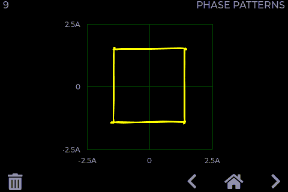

&nbsp;

The screenshot below show an operation of a stepper in half steps mode. The dimension of the pattern indicate good current feed, and the shape is somewhere between the square shape of full step mode and the round shape of micro stepping interpolation mode.

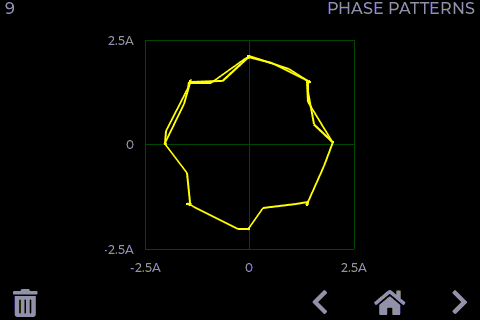

&nbsp;

#### Page Data

Data | Description
:------------ | :-------------
Lissajous&nbsp;curve | A Lissajous curve drawn from the current pattern of coil 1 (x) and coil2(y). 
Capture speed | Shows the signal capture time. Fast mode works better with fast moving steppers and slow mode works with slow moving steppers. Tap the graph to toggle.

**NOTES** 
* The graph is updated only when sufficient stepper motor movement is detected.
* To view the current pattern that resulted in the current phase pattern, use the navigation button to switch the current patters page, and vice versa.

&nbsp;
#### Page Actions

Action | Description
:------------: | :-------------
 | Clear all data.
 | When running, pauses the display updates.
 | When paused, resume the display updates.
Tap the graph | This toggles the capture time between fast and slow speeds.

&nbsp;

---

## Reference Design Specification

Item | Specification
:------------ | :------------- 
Power consumption | 5V, 175ma.
Power connector | micro USB
MCU | 32bit ARM STM32F401CE @ 84Mhz.
Flashing | USB/DFU or SWD/Stlink V2.
Data link | USB/Serial link available but not used.
Current measurement | +/-2.5A per coil. +/-5A sensors available.
Dimensions | 97 x 66 mm
TFT Resolution | 480 x 320, Color. Landscape mode.
Touch screen | Capacitive
Sensor isolation | See ACS70331 data sheet
Sampling rate | 100Khz per channel.
Sampling resolution | 12bits
Current accuracy | estimated at +/- 1%
Max speed | Software dependent. Currently 2K full steps/sec.
Step resolution | 1/100th of a full step.
Partial steps measurement | Software dependent. Not implemented.
Settings storage | On board EEPROM chip.
GUI framework | LVGL library. R3G3B2 color depth.
Programming language | C++
Programming IDE | Platform.io. Arduino/STM32.
Cad package | Kicad.

&nbsp;

---

## I want to build me one

The electronic schematic, PCB layout, gerber files, and the firmware source files and released binary are all available on this github repository.

[Schematic](./www/stepper_analyzer-sch.pdf)

&nbsp;

####BOM

Part | Specification | Info
:------------ | :------------- | :------------------
TFT display | ER-TFTM035-6, Pin Header Connection-8080 16-bit Parallel, 5.0V, Capacitive Touch Panel, No font chip. | https://www.buydisplay.com/lcd-3-5-inch-320x480-tft-display-module-optl-touch-screen-w-breakout-board
STM32F401CE BlackPill| WeAct Studio STM32F401C, 25Mhz crystal. | https://github.com/WeActTC/WeAct-Studio-Product
2 x current sensor.  | Allegro +/-2.5A galvanic isolated current sensor. | Allegro ACS70331EESATR-2P5B3
Settings EEPROM | Microchip AT24C02D-SSHM-T | 256 bytes, I2C, 8-SOIC. 
TFT connector | 2x20 pins, 0.1" pitch, female header.
2 x stepper connector | 4 pin, 0.1" pitch, right angle, male, KF2510 connector. |Available from Aliexpress.
Resistors, capacitors, LEDS | Per the schematic diagram | Typical package is SMD 0603. 
PCB | 97 x 66 mm, 2 layers, standard design rules, gerber files are available on github | JLCPCB, PCBWay, etc, or shop at https://pcbshopper.com/

A compatible TFT/Touch can be ordered at https://www.buydisplay.com/lcd-3-5-inch-320x480-tft-display-module-optl-touch-screen-w-breakout-board. Make sure to specify these options:

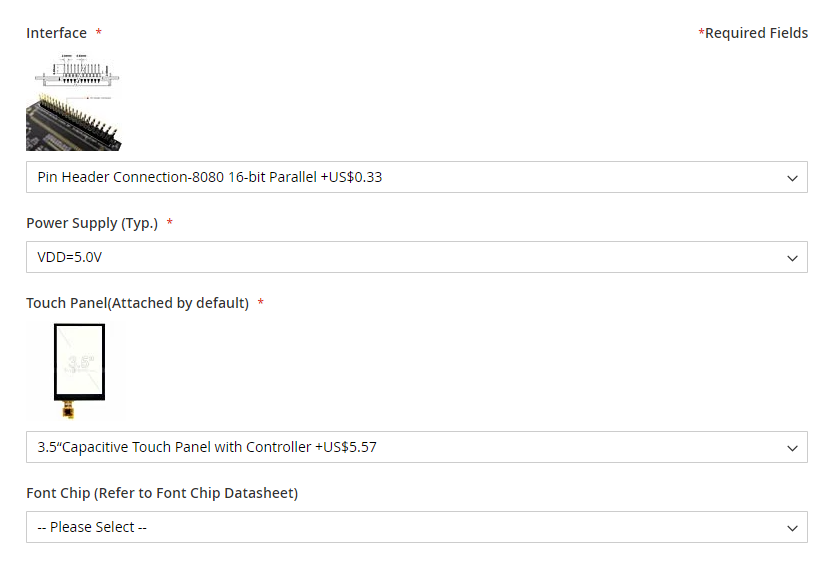

**Instructions:** Build the PCB, use DFU or SWD protocols to program the released binary into the Blackpill, plugin the TFT screen, power and use. See instructions below on how to flash the firmware release you can find on this github repository.

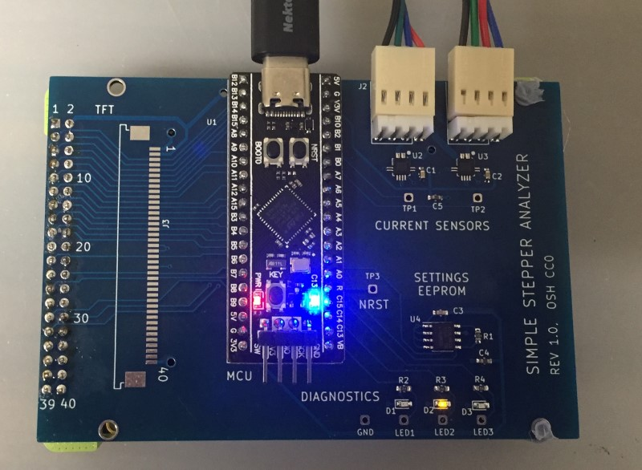

&nbsp;

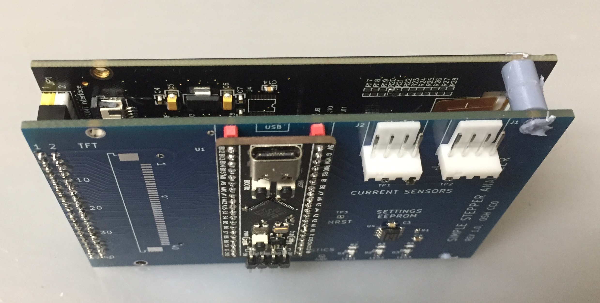

## Flashing a new firmware
Flashing the Analyzer with firmware can be done in a few ways. For software developers we recommend using StLink V2 and SWD which are well supported by the platformio IDE and enable debugging ans single stepping. A simpler approach that is recommended for end users is to use the builtin DFU protocol of the Analyzer's STM32 processor such as the one we use here. Adafruit has a [good description of the process](https://learn.adafruit.com/adafruit-stm32f405-feather-express/dfu-bootloader-details). The only difference that to enable the DFU bootloader mode connect the analyzer to the computer while its BOOT0 on button on the back is pressed.

**ONLINE LOADER:** We also had good results with Google Chrome browser and this online loader https://devanlai.github.io/webdfu/dfu-util/ . The Analyzer should appear as STM32 BOOTLOADER and should be programmed with the configuration Internal Flash 0x08000000.

## How to modify the firmware?
The source code of the Analyzer is available on this github repository. It is a STM32 C++ Platformio project that uses the Arduino framework. The user interface is based on the LVGL library and the project includes its own port to support TFT/Touch used.  Knowledge of C++ and Platformio is required and is outside the scope of this document.

## Mechanical
We provide here a [3D model of a simple open frame carrier](./3d/base.stl). This design does not requires attaching the analyzer and the TFT board with screws or spacers and guarantees proper separation on the loose end. If you have an interesting design which you would like to share, please post in a model sharing site such as cults3d, thingiverse or grabcad and we will link it here.

## Ideas for improvements
The Analyzer is provided as a fully functional reference design and changes and the developers encourage improvement/modifications of the hardware and/or firmware are encouraged. This can include new features, new measurements and pages, extending the design to support 2 or 3 steppers at once to track the x/y/z of a 3D printer, reducing the hardware cost using less expensive screen TFT, or even eliminating the screen altogether and using the Analyzer as a dongle tethered to a computer via the existing USB/Serial link.

&nbsp;

---

## FAQ

#### Q: Why not a SPI based TFT?

A: We could not achieve fast enough display refresh rate with SPI so switched to 16 bit parallel data transfers.

#### Q: Can a cheaper TFT/touch be used?
A: Yes, but it may require firmware changes.

#### Q: Can the TFT screen be eliminated?
A: Yes. The Analyzer has a USB/Serial output can a small Analyzer dongle can communicate with a computer program. This will require firmware changes.
 
#### Q: Can I connect the Analyzer to the TFT using a FFC cable?

A: Yes. The PCB was designed for both 0.1" header and 40 pins 1.0mm FFC cable connections.  You will need a short (e.g. 60mm or less) type B ('reversed') FFC cable. Cables longer than let's say 100mm may introduce noises the will interfere with the operation of the display. 

#### Q: Can you add feature X or customization Y?

A: Most likely not. The reference design is provided for the community to change and mix.

#### Q: I want to commercialize or crowd source it, can you help me?

A: Most likely not. The reference design is open source and you will need to find others to help you.

#### Q: Where do I file a bug?

A: Use the github repository.

#### Q: Is it ok to connect/disconnect power to the Analyzer while my 3D printer prints?

A: Of course. The Analyzer is isolated from the stepper wires and should not interfere with the operation of the printer.

#### Q: The Analyzer uses LVGL lib, what is the license of that library?

A: At the time of writing this, the LVGL license is available here https://github.com/lvgl/lvgl/blob/master/LICENCE.txt.  The Analyzer's developers are not affiliated with LVGL.

#### Q: Is the LVGL library included in the Analyzer's repository?

A: It's not needed. LVGL is supported by platform.io so the Analyzer's project is set for platform.io to fetch LVGL automatically.

#### Q: Can I use a STM32F401CE MCU with a 8Mhz crystal.

A: The provided firmware assumes a 25Mhz crystal. For a 8Mhz crystal you will need to change the firmware.

#### Q: I can't find a STM32F401CE/25Mhz blackpill but I can find an STM32F411CE/25Mhz, will this work?

A: Most like it will work with the provided firmware as is (and with no performance benefits), but we do not guarantee it. We may switch the official reference design to the STMF411CE/25Mhz if the STM32F401CE/25Mhz, which is less expensive, will not be available.

#### Q: Can I use a blackpill with different pinout than WeAct ?

A: No, unless if you are willing to change the PCB.

