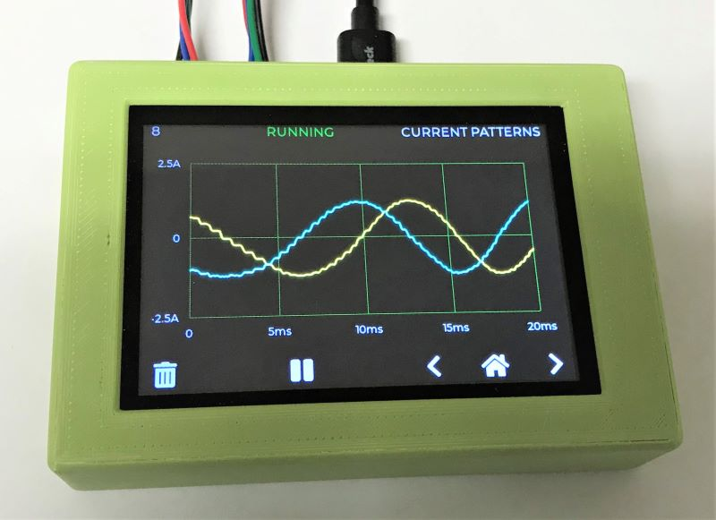
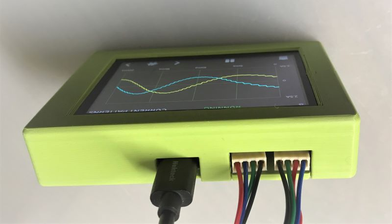
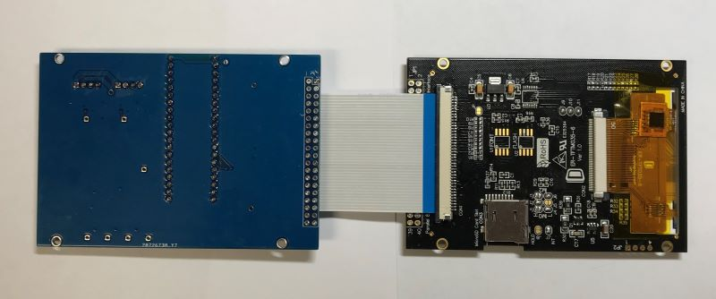
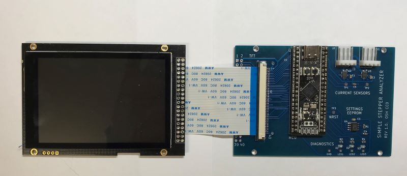
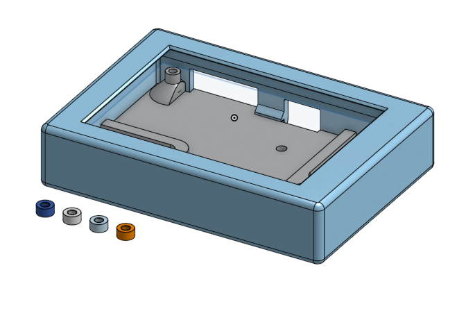

# Fully enclosed 3D printed case option

&nbsp;

&nbsp;

## Summary
This page describes an alternative way to constructs the the Simple Stepper Motor Analyzer that is slightly more involved and arguably more satisfying than the standard option. Instead having the analyzer's board connects to the TFT screen via a 40 pins header and placed on a 3D printed open base, it is attached via a short flex cable (FFC) and is held in a fully enclosed 3D printed case.

## Differences from the the standard open base construction
* This option uses the exact same PCB and electronic components as the standard options.
* Instead of soldering the 2x20 pin 0.1" header on the analyzer's PCB, solder a 40 pin 1.0 FFC surface mount connector.
* Instead of ordering a TFT module with a 40 pin header, order the same TFT module but with the FFC connector option.  (If you already have the TFT module with the 40 pins header option and if you are good with soldering, you can convert it by removing the header and soldering instead a FFC connector).
* Use a short 40 wires (ideal ~30mm, longer such as 60mm should also work), 1.0mm FFC cable to connect the analyzer and TFT boards. You will need a 'type B' or 'reversed' cable type that has the exposed contacts of opposing sides.
* 3D print the parts in the file http://github.com/zapta/simple_stepper_motor_analyzer/blob/master/3d/case.stl
* Set the temperature of your solder iron close to the printing temperature of the case and use it to embed four M2.5 x 3.5mm OD x 3mm length brass threaded inserts.
* Use four M2.5 16mm socket head screw to attach everything together, the four spaces fit between the TFT and the analyzer's PCB.

**NOTE:** The OnShape source file of the case is at 
https://cad.onshape.com/documents/146b8b994145177887407b23/v/f2052a33bf7ac8993e3d7406/e/b6453eca2ba530476c30538a

&nbsp;

&nbsp;

&nbsp;

&nbsp;

